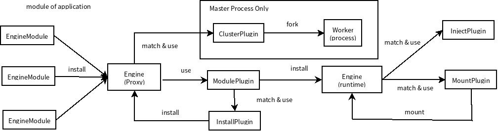

# brick-cluster #
基于[brick-engine](https://github.com/kiba-zhao/brick-engine)的集群工具包.用于构建基于[brick-engine](https://github.com/kiba-zhao/brick-engine)的多进程应用程序.



## Install ##

``` shell
npm install --save brick-cluster
```

## Usage ##
使用bin/brick-cluster来启动应用.

``` shell

# 默认为当前执行路径
npx brick-cluster

# 指定应用路径(应用包路径/应用入口文件路径)
npx brick-cluster {path 1} {...} {path N}
```

### Entry Point ###
引擎需要使用应用入口来启动应用程序

> 请参考: [brick-engine应用入口](https://github.com/kiba-zhao/brick-engine#entry-point)

## Documentations ##
使用`jsdoc`生成注释文档

``` shell
git clone https://github.com/kiba-zhao/brick-cluster.git
cd brick-cluster
npm install
npm run docs
open docs/index.html
```

## License ##
[MIT](LICENSE)
